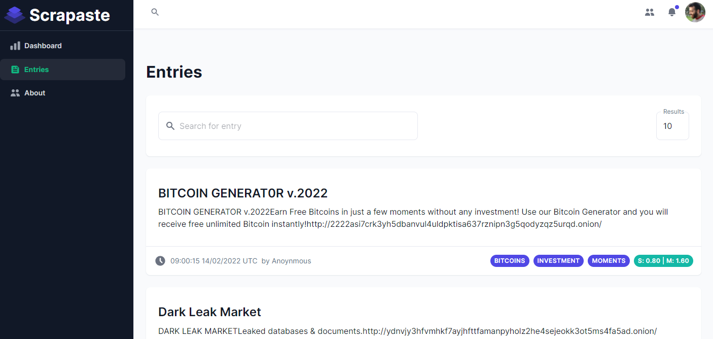

<!-- PROJECT LOGO -->
 

    
  

    the official backend repo of Scrapaste
       
    <a href="https://scrapaste-api.herokuapp.com/api">API URL</a>
    ·
    <a href="https://scrapaste.herokuapp.com/Entries">Visit App</a>
  

## About The Project

Scrapaste is a scraping service that extracts information off darknet pastebins.

This project was originally created as a class project for my programming course

### Built With

 

- React.js
- Express
- Next.js
- Redux Toolkit
- MongoDB
- MUI

<!-- GETTING STARTED -->

## Getting Started

API URL can be accessed through this [link](https://scrapaste-api.herokuapp.com/api)

This repo is the backend that serves Scrapaste's front-end. Here's a [link](https://github.com/strauss02/scraper-frontend) to the frontend repo, which is more detailed.

(<a href="#top">back to top</a>)

